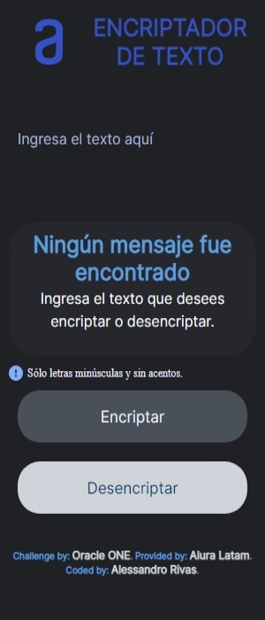
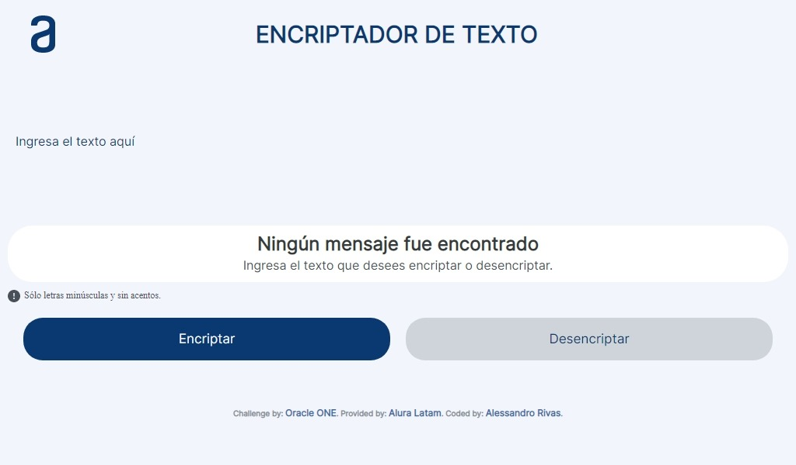
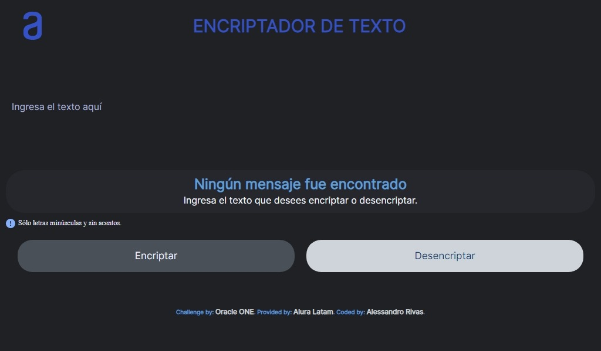
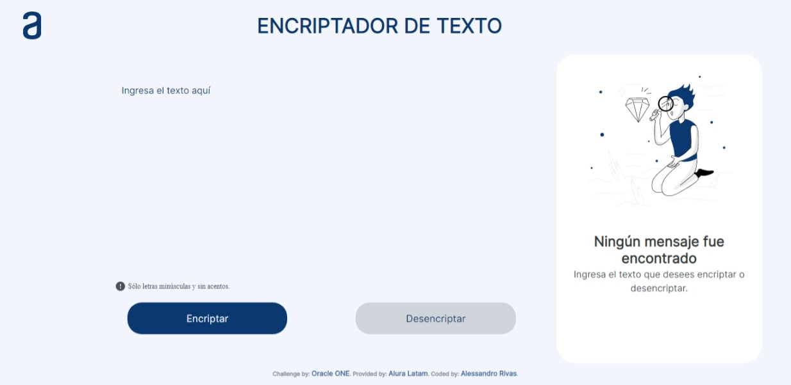

# **Text Encrypter**

*This is a Challenge made by [Alura Latam](https://www.aluracursos.com/) of the program alliance between [Oracle](https://www.oracle.com/) and [Alura Latam](https://www.aluracursos.com/) called [Oracle ONE (Oracle Next Education)](https://www.oracle.com/ar/education/oracle-next-education/).*

*Link Page:* [Github Pages](https://alessandrror.github.io/main-repository/Encrypter/index.html).

## **About the Project**

This is a Web Application builded with HTML5, CSS3 and JavaScript with the idea of encrypt and decrypt text following the next rules:

```
Letter 'a' is converted to 'ai'
Letter 'e' is converted to 'enter'
Letter 'i' is converted to 'imes'
Letter 'o' is converted to 'ober'
Letter 'u' is converted to 'ufat'
```

***Requirements:***

> Should work with lowercase letters only.
> Letters with accent or special characters should not be used.
> It should be posible to convert a word to the encrypted version as well as return an encrypted Word to its original version.
> The page must have fields to insert the text that will be encrypted or decrypted, and the user must be able to choose to enter both options.
> The result should be displayed on the screen.

***For Example:***

```
'gato' => 'gaitober'
'gaitober' => 'gato'
```

***Extras:***

> A button that copies the encrypted/decrypted text for the transfer section, that is, it has the same functionality as `Ctrl` + `C` or the 'Copy' option in the applications menu.

## **Preview**

<p align="center"><em>Light Mode</em> | <em>Dark Mode</em></p>

<div align="center">
 
 
 
</div>