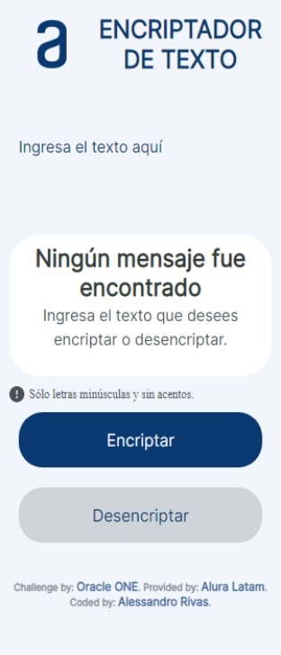
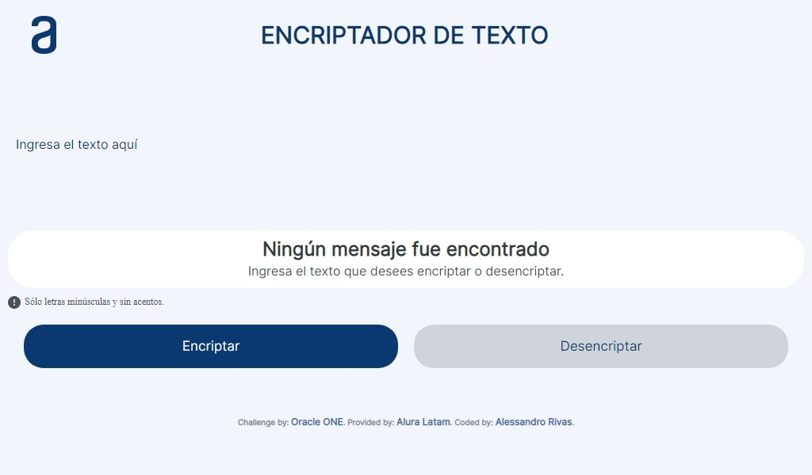
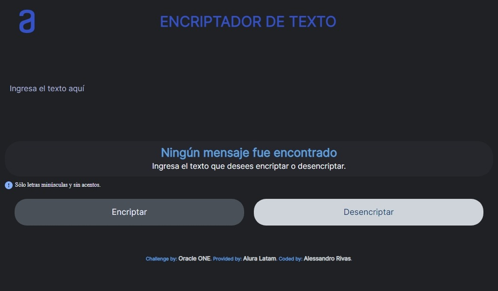

# **Encriptador de Texto**

*Este es un Desafío hecho por [Alura Latam](https://www.aluracursos.com/) del programa alianza entre [Oracle](https://www.oracle.com/) y [Alura Latam](https://www.aluracursos.com/) llamado [Oracle ONE (Oracle Next Education)](https://www.oracle.com/ar/education/oracle-next-education/).*

*Enlace a la Página:* [Github Pages](https://alessandrror.github.io/main-repository/Encrypter/index.html).

Clic [aquí](README-ES.md) para ver la versión en `ES`.

## **Sobre el Proyecto**

Esta es una Aplicación Web construida con HTML5, CSS3 y JavaScript con la idea de encriptar y desencriptar texto siguiendo las siguientes reglas:

```
La letra 'a' es convertida a 'ai'
La letra 'e' es convertida a 'enter'
La letra 'i' es convertida a 'imes'
La letra 'o' es convertida a 'ober'
La letra 'u' es convertida a 'ufat'
```

***Requerimientos:***

> Debe funcionar solo con letras minúsculas.
> No deben ser utilizados letras con acentos ni caracteres especiales.
> Debe ser posible convertir una palabra para la versión encriptada también devolver una palabra encriptada para su versión original.
> La página debe tener campos para inserción del texto que será encriptado  desencriptado, y el susuario debe poder escoger enter las dos opciones.
> El resultado debe ser mostrado en pantalla.

***Por Ejemplo:***

```
'gato' => 'gaitober'
'gaitober' => 'gato'
```

***Extras:***

> Un botón que copie el texto encriptado/desencriptado para la sección de transferencia, o sea que tenga la misma funcionalidad del `Ctrl` + `C` o de la opción "copiar" del menú de las aplicaciones.

## **Vista Anticipada**

<p align="center"><em>Modo Claro</em> | <em>Modo Oscuro</em></p>

<div align="center">
 
 
 
</div>
