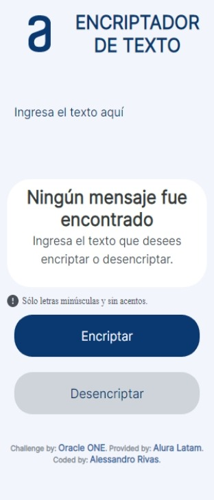
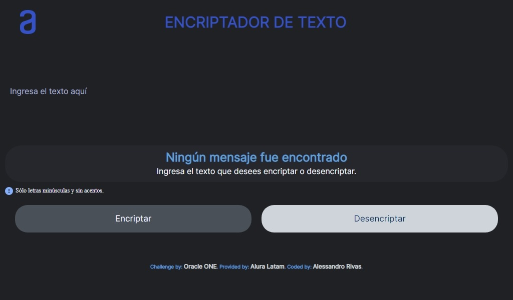
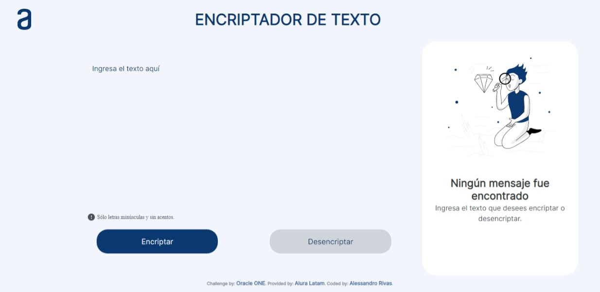
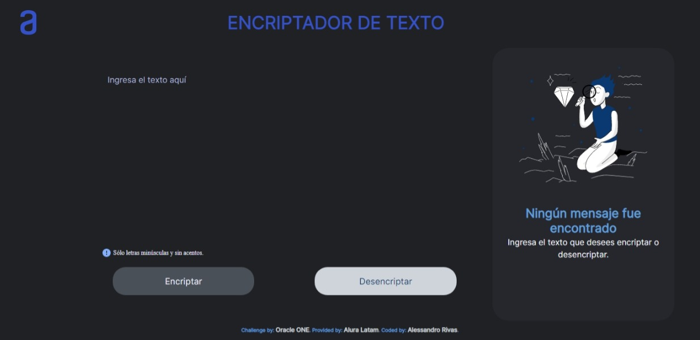

# Alura Challenge Encrypter

This project is an ***encrypter/decrypter***, so it's an application that can encrypt or decrypt text. This challenge was created by Alura Latam with Oracle and its program ONE Oracle Next Education:


# **Text Encrypter | Encriptador de Texto**

*Link Page | Enlace a la Página*
[Github Pages](https://alessandrror.github.io/main-repository/Encrypter/index.html).

## **Preview | Vista Anticipada**

<p align="center"><em>Modo Claro</em> | <em>Modo Oscuro</em></p>

<details>
<summary>Mobile</summary>
<div align="center">
 
</div>
</details>

<details>
<summary>Tablet</summary>
<div align="center">
 
</div>
</details>

<details>
<summary>Computer</summary>
<div align="center">
 
</div>
</details>

*This is a Challenge made by [Alura Latam](https://www.aluracursos.com/) of the program alliance between [Oracle](https://www.oracle.com/) and [Alura Latam](https://www.aluracursos.com/) called [Oracle ONE (Oracle Next Education)](https://www.oracle.com/ar/education/oracle-next-education/).*

<details>
<summary>Click here to view the README `EN` version.</summary>

# **Text Encrypter**

*This is a Challenge made by [Alura Latam](https://www.aluracursos.com/) of the program alliance between [Oracle](https://www.oracle.com/) and [Alura Latam](https://www.aluracursos.com/) called [Oracle ONE (Oracle Next Education)](https://www.oracle.com/ar/education/oracle-next-education/).*

*Link Page:* [Github Pages](https://alessandrror.github.io/main-repository/Encrypter/index.html).

## **About the Project**

This is a Web Application builded with HTML5, CSS3 and JavaScript with the idea of encrypt and decrypt text following the next rules:

```
Letter 'a' is converted to 'ai'
Letter 'e' is converted to 'enter'
Letter 'i' is converted to 'imes'
Letter 'o' is converted to 'ober'
Letter 'u' is converted to 'ufat'
```

***Requirements:***

> Should work with lowercase letters only.
> Letters with accent or special characters should not be used.
> It should be posible to convert a word to the encrypted version as well as return an encrypted Word to its original version.
> The page must have fields to insert the text that will be encrypted or decrypted, and the user must be able to choose to enter both options.
> The result should be displayed on the screen.

***For Example:***

```
'gato' => 'gaitober'
'gaitober' => 'gato'
```

***Extras:***

> A button that copies the encrypted/decrypted text for the transfer section, that is, it has the same functionality as `Ctrl` + `C` or the 'Copy' option in the applications menu.

</details>

*Este es un Desafío hecho por [Alura Latam](https://www.aluracursos.com/) del programa alianza entre [Oracle](https://www.oracle.com/) y [Alura Latam](https://www.aluracursos.com/) llamado [Oracle ONE (Oracle Next Education)](https://www.oracle.com/ar/education/oracle-next-education/).*

<details>
<summary>Clic aquí para ver la versión README en `ES`.</summary>

# **Encriptador de Texto**

*Este es un Desafío hecho por [Alura Latam](https://www.aluracursos.com/) del programa alianza entre [Oracle](https://www.oracle.com/) y [Alura Latam](https://www.aluracursos.com/) llamado [Oracle ONE (Oracle Next Education)](https://www.oracle.com/ar/education/oracle-next-education/).*

*Enlace a la Página:* [Github Pages](https://alessandrror.github.io/main-repository/Encrypter/index.html).

Clic [aquí](README-ES.md) para ver la versión en `ES`.

## **Sobre el Proyecto**

Esta es una Aplicación Web construida con HTML5, CSS3 y JavaScript con la idea de encriptar y desencriptar texto siguiendo las siguientes reglas:

```
La letra 'a' es convertida a 'ai'
La letra 'e' es convertida a 'enter'
La letra 'i' es convertida a 'imes'
La letra 'o' es convertida a 'ober'
La letra 'u' es convertida a 'ufat'
```

***Requerimientos:***

> Debe funcionar solo con letras minúsculas.
> No deben ser utilizados letras con acentos ni caracteres especiales.
> Debe ser posible convertir una palabra para la versión encriptada también devolver una palabra encriptada para su versión original.
> La página debe tener campos para inserción del texto que será encriptado  desencriptado, y el susuario debe poder escoger enter las dos opciones.
> El resultado debe ser mostrado en pantalla.

***Por Ejemplo:***

```
'gato' => 'gaitober'
'gaitober' => 'gato'
```

***Extras:***

> Un botón que copie el texto encriptado/desencriptado para la sección de transferencia, o sea que tenga la misma funcionalidad del `Ctrl` + `C` o de la opción "copiar" del menú de las aplicaciones.

</details>
